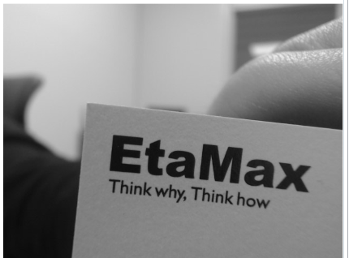
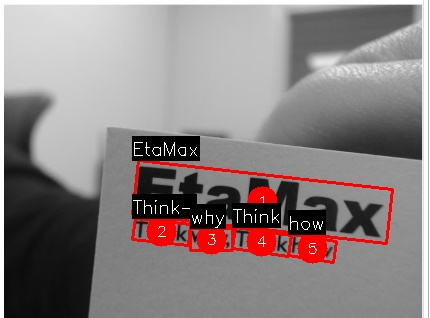

# toy_OCR
CRAFT와 EasyOCR을 활용하여 만든 OCR
* CRAFT로 텍스트 영역 검출 (Detection), 기울기 보정(affine 변환)
* 다양한 전처리 적용 (이미지 특성마다 조금씩 바꿔야함)
* EasyOCR로 텍스트 인식 (Recognition)

## requirements
### A. 환경구성 w/bash script
* `bash requirements.sh` 실행

### B. script 설치가 불가한 경우
* `socket_ocr.py` 또는 `ocrtest.py` 실행 시 필요 라이브러리 자동 설치
* 단, CRAFT의 가중치는 **꼭 수동 다운로드** 받아야함
  * [ClovaAI - CRAFT git](https://github.com/clovaai/CRAFT-pytorch?tab=readme-ov-file) 페이지 방문, General model (`craft_mlt_25k.pth`) 다운로드
  * CRAFT-pytorch/weights 폴더에(없으면 생성) 저장
* 딥러닝 기반이므로 GPU가 있어야 추론 시간 짧음

## 실행
* ocrtest.py : 로컬 이미지 ocr 실행
* socket_ocr.py : 통신 기반 ocr 실행

## 샘플 결과

| 입력 이미지 | OCR 결과 이미지 |
|:---:|:---:|
|  |  |